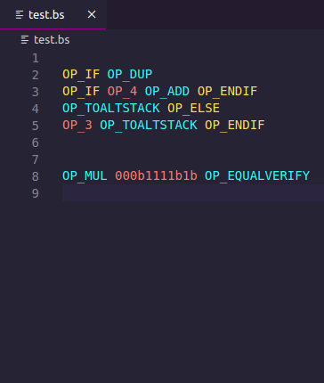
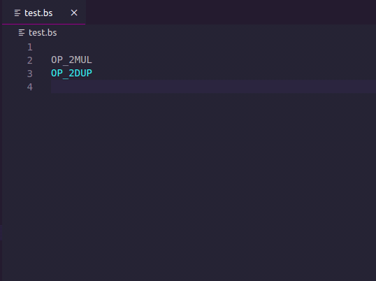

# Bitcoin Scripting Language

This is the vscode language extension pack for the Bitcoin Scripting Language also known as Bitcoin Script or simply, Script. Specifically, this extension adheres to the grammar for post-genesis Bitcoin SV.

The file type for the Bitcoin Scripting Language is `.bs`

## Features
- [x] Syntax highlighting
- [x] Formatting
- [x] Code Snippets
- [x] Definitions
- [ ] Debugger
- [ ] Linter

### Formatting
The formatter automatically puts each opcode and piece of data on a new line. All OP_IF/OP_ELSE branches are indented.

### Definitions
The definitions are based on the definitions.yaml file which was created by scraping the [Bitcoin Wiki](https://en.bitcoin.it/wiki/Script) and later corrections were added from the [Bitcoin SV Wiki](https://wiki.bitcoinsv.io/index.php/Opcodes_used_in_Bitcoin_Script). To add or update definitions please make a PR editing the `definitions/bitcoinscript.yaml` file.

## Installation
* Launch VS Code Quick Open (Ctrl+P), paste the following command, and press enter:
* `ext install shade.bsl`

Alternatively, you can download the extension from the [marketplace](https://marketplace.visualstudio.com/items?itemName=shade.bsl).

## Release Notes
### 0.0.12
- New syntax highlighting (reserved OPCODES now supported)
- Formatter for indenting based on OP_IF/OP_ELSE branches
- Hover card based on definitions file.

### 0.0.6
Initial release of BSL

