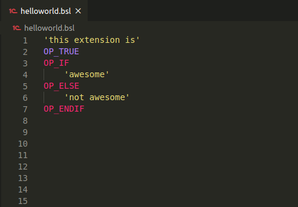

# Bitcoin Scripting Language (BSL)

This is the syntax highlighting extension for Bitcoin Script. Specifically, this adheres to the grammar for post-genesis Bitcoin SV.

The file type for Bitcoin Script is `.bs`

## Features
- [x] Syntax highlighting
- [x] Formatting
- [x] Code Snippets
- [] Linting

## Installation
* Launch VS Code Quick Open (Ctrl+P), paste the following command, and press enter:
* `ext install shade.bsl`

Alternatively, you can download the extension from the [marketplace](https://marketplace.visualstudio.com/items?itemName=shade.bsl).

## Release Notes

### 0.0.6
Initial release of BSL

### 0.0.7
Change the file extension from `.bsl` to `.bs`